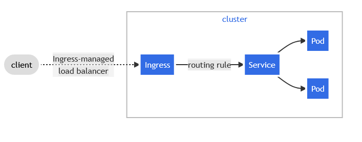

# Deploying Tasker App on Oracle Cloud Infrastructure

## Table of contents

- [Deploying Tasker App on Oracle Cloud Infrastructure](#deploying-tasker-app-on-oracle-cloud-infrastructure)
  - [Table of contents](#table-of-contents)
  - [About deploying Tasker app on OCI](#about-deploying-tasker-app-on-oci)
  - [Tasker Application structure](#tasker-application-structure)
  - [Deploying strategies](#deploying-strategies)
    - [Using one image](#using-one-image)
    - [Using two images](#using-two-images)
  - [Solution proposal](#solution-proposal)

## About deploying Tasker app on OCI

One of the advantages of containerized the application is that we can deploy and run the application on cloud infrastructure. In this case the cloud platform in which the application is going to be deployed is [Oracle Cloud Interface]((https://www.oracle.com/cloud/)).

Oracle offers a try for free subscription that we can use during a month and with US$300 in free credits. I will use this subscription to test how the application runs in a Cloud infrastructure.

## Tasker Application structure

Tasker application has been developed using to different projects once for the frontend (tasker-app) based on React, and the other project for exposing the REST Api (tasker-api) based on Dropwizard. Using this approach allows to work in the front and in the back in an independent way.

## Deploying strategies

We can address different approach for deploying the whole application.

### Using one image

The idea behind this is to create a single Docker image including both applications. This implies that the Docker container would have to run Node.js and Jersey inside it.

The image finally would be running on a Container Engine for Kubernetes (OKE) with a single Pod.

This approach has the advantage that the communication between Frontend and Backend will be local. The main disadvantage of using this way is that we can not manage the scalability of the Node.js and the Jersey servers independently

### Using two images

In this way we would create one image for the front application (tasker-app) and another one for the back application (tasker-api).
This has the advantage that we can manage the resources and the scalability of both parts independently.

On the other hand using this approach increases the complexity about how to communicate bot applications because each one will be running in its own pod.

## Solution proposal

In this case I think that the best option is to use independent images for the frontend and for the backend. These images will be deployed in two different pods with two different services.

This confronts a problem regarding the communication between front and end apps. The main problem here is that the calls to the backend will be resolved by the Javascript objects in the browser.  

Another additional problem about this solution it's the fact that the OKE cluster public IP is not fixed and that the communications between the container won't be via localhost.This implies that the configuration of the endpoint's IP could change from time to time and this would be able to be changed in the front App.

To solve this problem the best option is to have an Ingress object (An API object that manages external access to the services in a cluster, typically HTTP) object that can route the request to one service or another depending on the path. Yo can read more information about this approach [here](https://kubernetes.io/docs/concepts/services-networking/ingress/).
<br/>
<br/>

<br/>
<br/>
This is the ingress definition:
<br/>

```yaml
apiVersion: networking.k8s.io/v1
kind: Ingress
metadata:
  name: tasker-ingress
  annotations:
    kubernetes.io/ingress.class: "nginx"
spec:
  rules:
  - http:
      paths:
        - path: /
          pathType: Prefix
          backend:
            service:
              name: tasker-app-svc
              port:
                number: 3000
        - path: /task
          pathType: Prefix
          backend:
            service:
              name: tasker-api-svc
              port:
                number: 8080
```
With this setup all the traffic from the root domain will be resolved by the frontend app and all the requests from the front app to /app path will be resolved by the backend service.

As result we will have the following parts:
- One ingress service
- One pod for tasker-app with one service
- One pod for tasker-api with one service

Inside the **/infrastructure/oci-tasker** folder you can see the files needed to create these items.

<br/>
<br/>

[Go to main page](../README.md)